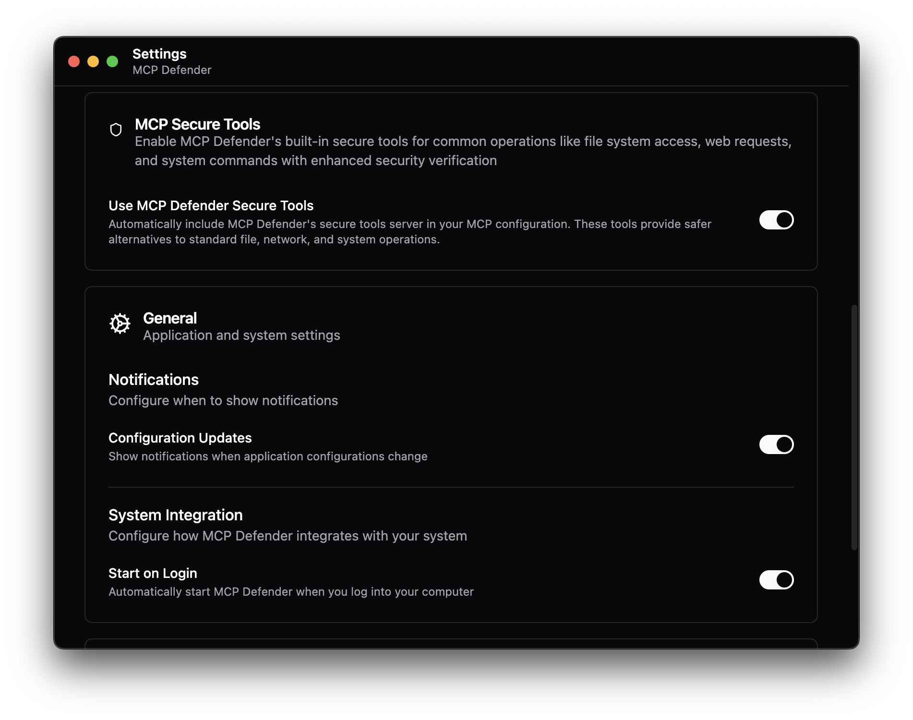

# MCP Defender Secure Tools

Node.js MCP server providing security-enhanced versions of Cursor's built-in tools for secure development workflows.

## Overview

MCP Defender Secure Tools acts as a secure proxy layer between Cursor IDE and filesystem operations. By providing security-enhanced versions of Cursor's built-in tools through the Model Context Protocol (MCP), this server enables MCP Defender to monitor, validate, and secure all tool interactions within allowed directory boundaries.

## Key Features

- **Security-Enhanced Tool Mapping**: Provides secure alternatives to Cursor's built-in tools
- **Path Validation**: All operations are restricted to pre-configured allowed directories
- **Audit Logging**: Integration with MCP Defender for comprehensive security monitoring  
- **Access Control**: Symlink validation and real path checking
- **macOS CLI Integration**: Leverages native macOS tools for optimal performance

## Quick Start

1. **Download and Install MCP Defender**
   
   Download and install MCP Defender from: https://github.com/MCP-Defender/MCP-Defender

2. **Enable Secure Tools**
   
   In MCP Defender, ensure the "Use MCP Defender Secure Tools" toggle is turned **ON**:
   
   
   
   This automatically includes MCP Defender's secure tools server in your MCP configuration, providing safer alternatives to standard file, network, and system operations.

3. **Start Using Secure Tools**
   
   Once enabled, AI applications like Cursor, Claude, and VS Code will automatically use the security-enhanced versions of tools provided by this server instead of their built-in equivalents.

## Architecture

This MCP server intercepts and secures the following Cursor tool operations:

- File reading and editing
- Directory listing and searching
- Code searching and text searching (grep)
- Terminal command execution
- File deletion

Each tool includes explicit messaging to prioritize the secure MCP version over Cursor's built-in equivalents.

## Available Tools


### File Operations

#### `read_file`
🔒 **Security-Enhanced**: Secure file reading with path validation
- **Input**: 
  - `path` (string) - Path to file (relative to working directory or absolute within boundary)
- **Security**: Path validation, symlink resolution, working directory boundary checking
- **Usage**: Use relative paths (e.g., `src/index.ts`) or absolute paths within the working directory

<!-- #### `edit_file` 
🔒 **Security-Enhanced**: Secure file editing with diff preview
- **Input**: 
  - `path` (string): Path to file (relative to working directory or absolute within boundary)
  - `edits` (array): Edit operations with oldText/newText pairs
  - `dryRun` (boolean): Preview changes without applying
- **Security**: Path validation, atomic operations, diff preview for safety
- **Usage**: Use relative paths (e.g., `src/index.ts`) or absolute paths within the working directory -->

#### `delete_file`
🔒 **Security-Enhanced**: Secure file deletion
- **Input**: 
  - `path` (string) - Path to file (relative to working directory or absolute within boundary)
- **Security**: Path validation before deletion
- **Usage**: Use relative paths (e.g., `src/index.ts`) or absolute paths within the working directory

### Directory Operations

#### `list_directory`
🔒 **Security-Enhanced**: Secure directory listing  
- **Input**: 
  - `path` (string) - Path to directory (relative to working directory or absolute within boundary)
- **Security**: Working directory boundary validation
- **Output**: Formatted list with [DIR]/[FILE] prefixes
- **Usage**: Use relative paths (e.g., `src`) or absolute paths within the working directory

#### `search_files`
🔒 **Security-Enhanced**: Secure file search using macOS find
- **Input**:
  - `path` (string): Starting directory (relative to working directory or absolute within boundary)
  - `pattern` (string): Search pattern
  - `excludePatterns` (string[]): Patterns to exclude
- **Security**: Path validation, restricted to working directory boundary
- **Usage**: Use relative paths (e.g., `src`) or absolute paths within the working directory

### Code Search Operations

#### `codebase_search`
🔒 **Security-Enhanced**: Secure semantic code search
- **Input**:
  - `query` (string): Search query
  - `searchPath` (string, optional): Directory to search in (relative to working directory, or omit to search entire boundary)
  - `fileTypes` (string[]): File type filters (optional)
  - `maxResults` (number): Result limit (default: 50)
- **Security**: Uses macOS find+grep with working directory boundary restrictions
- **Usage**: Optionally specify searchPath within the working directory boundary

#### `grep_search`
🔒 **Security-Enhanced**: Secure text search with regex support
- **Input**:
  - `pattern` (string): Search pattern
  - `path` (string, optional): Search path (relative to working directory, or omit to search entire boundary)
  - `filePattern` (string): File pattern filter (default: "*")
  - `caseSensitive` (boolean): Case sensitivity (default: false)
  - `maxResults` (number): Result limit (default: 100)
- **Security**: Native macOS grep with working directory boundary control
- **Usage**: Optionally specify path within the working directory boundary

### System Operations

#### `run_terminal_command`
🔒 **Security-Enhanced**: Secure command execution
- **Input**:
  - `command` (string): Command to execute
  - `workingDirectory` (string, optional): Working directory (relative to boundary or absolute within boundary)
  - `timeout` (number): Timeout in ms (default: 30000)
- **Security**: Working directory validation, timeout controls, sandboxed execution within boundary
- **Usage**: Optionally specify workingDirectory within the working directory boundary

## Recommended Workflow

1. **Start the server in your project directory**: The working directory becomes the security boundary
2. **Use relative or absolute paths**: Specify paths within the working directory boundary
3. **Scope searches appropriately**: Use optional path parameters in search tools to limit scope when needed

### Example Usage Pattern

```javascript
// 1. Use relative paths from the working directory
await mcpClient.callTool("list_directory", {
  path: "src"
});

// 2. Or use absolute paths within the boundary
await mcpClient.callTool("read_file", {
  path: "/Users/username/Projects/my-app/src/index.ts"
});

// 3. Search within the project
await mcpClient.callTool("codebase_search", {
  query: "function handleAuth",
  searchPath: "src"
});

// 4. Run commands
await mcpClient.callTool("run_terminal_command", {
  command: "npm test"
});
```

## Platform Support

**Currently Supported**: macOS (darwin)
- Leverages native macOS CLI tools (find, grep, sh)
- Optimized for macOS filesystem operations

**Coming Soon**: Linux and Windows support

## Installation & Usage

### NPX Installation
```bash
# Start the server from your project directory
cd /path/to/your/project
npx @mcpdefender/mcp-defender-secure-tools
```

The server uses the current working directory as the security boundary - all operations are restricted to this directory and its subdirectories.

### Usage with Cursor/Claude Desktop

Add to your MCP configuration:

```json
{
  "mcpServers": {
    "mcp-defender-secure-tools": {
      "command": "npx",
      "args": [
        "-y",
        "@mcpdefender/mcp-defender-secure-tools"
      ],
      "cwd": "/Users/username/Projects/my-project"
    }
  }
}
```

### Directory Security

The server automatically uses the working directory where it's started as the security boundary:

```bash
# Start from your project root
cd ~/Projects/my-app
npx @mcpdefender/mcp-defender-secure-tools

# All operations will be restricted to ~/Projects/my-app and subdirectories
```

**Security Model**:
- Operations restricted to the working directory and its subdirectories
- Supports both relative paths (`src/index.ts`) and absolute paths within the boundary
- Symlinks are resolved and validated against the working directory boundary
- Parent directory validation for new file creation
- Real path checking prevents directory traversal attacks

## Integration with MCP Defender

This server is designed to work seamlessly with MCP Defender for:

- **Tool Traffic Monitoring**: All tool calls are logged and monitored
- **Security Policy Enforcement**: Directory restrictions and access controls
- **Audit Trail**: Comprehensive logging of all filesystem operations
- **Threat Detection**: Suspicious activity detection and prevention

## Development

### Build
```bash
npm run build
```

### Watch Mode
```bash
npm run watch
```

### Project Structure
- `index.ts`: Main MCP server implementation
- `dist/`: Compiled JavaScript output
- Tool schemas defined using Zod for validation

## Security Considerations

- **Sandboxed Execution**: All operations restricted to allowed directories
- **Path Traversal Prevention**: Comprehensive path validation and normalization
- **Symlink Security**: Real path resolution and validation
- **Command Injection Protection**: Safe command execution with validation
- **Timeout Controls**: Prevents resource exhaustion attacks
- **Access Logging**: All operations logged for security monitoring

## Contributing

This project is part of the MCP Defender security ecosystem. Contributions should focus on:

- Enhanced security validations
- Additional platform support
- Performance optimizations
- Tool coverage expansion
